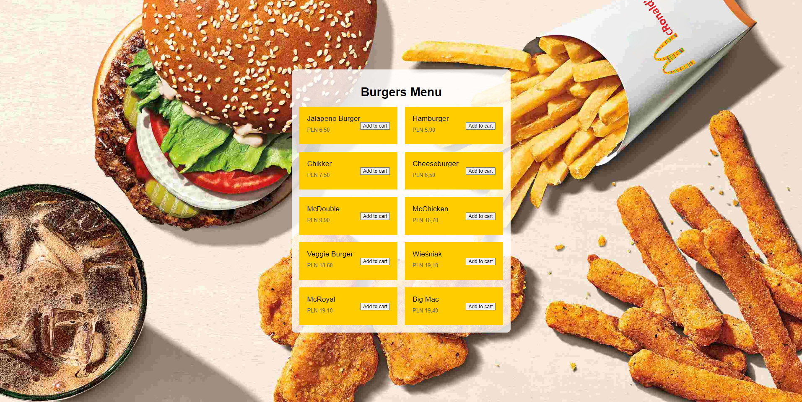
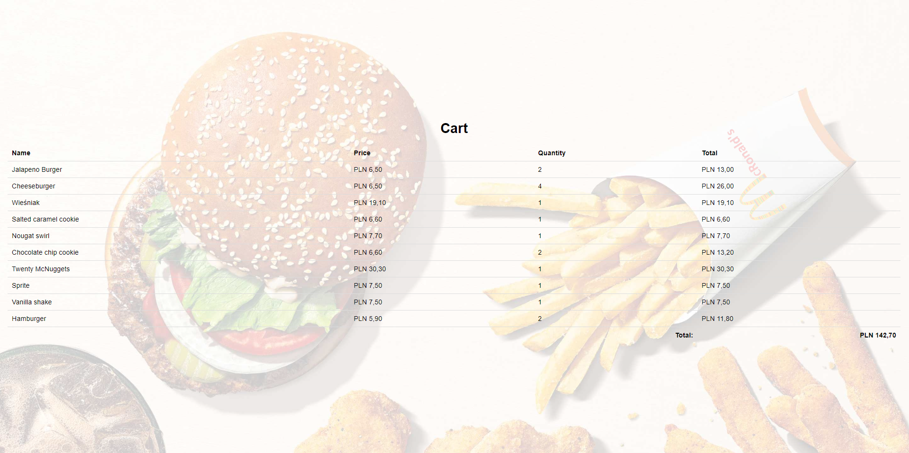

# McRonald's - gastronomy.kiosk.system with Spring

## Photos

## Table of contents
* [General info](#general-info)
* [Project info](#project-info)
* [Technologies used](#technologies-used)
* [Setup](#setup)

## General info
Work on the project is still in progress!

I would like to primarily focus on the backend aspect of the project as it aligns with initial goal of my learning path and advancing in that direction. The frontend part will serve as an opportunity to explore, learn, and understand the utilization of frontend technologies and their underlying principles. Frontend layer will serve as a solid foundation for GUI, UX, and create capabilities to enhance the graphical and interactive aspects, allowing for comprehensive testing of the application's correct operation.

## Project info
The McRonald's Gastronomy Kiosk System is a project designed to manage orders accepted outside the main cash register in devices located on the premises of the catering establishment. This system draws inspiration from one of the world leaders in the fast-food industry.

By employing McRonald's Gastronomy Kiosk System customers can conveniently place orders via self-service kiosks, increasing the efficiency and accuracy of the ordering process.

With a user-friendly interface, the McRonald's food kiosk system aims to provide customers with a hassle-free and enjoyable ordering experience. This project is an example of the inspiration of fast-food industry leaders' commitment to innovation in customer service systems and creating the best possible satisfaction for their customers experience.
	
## Technologies used
Project is created with:
- Java 11, 
- Maven,
- Spring,
- Spring Boot,
- MVC model,
- Rest architecture,
- Lombok,
- Thymeleaf,
- H2 Database,
- Hibernate ORM,
- JPA, 
- Crud.
	
## Setup
1. Deploy the project in your programming environment.
2. Open a web browser and navigate to https://localhost:8080/ 
3. Follow the on-screen instructions to proceed with the project.

